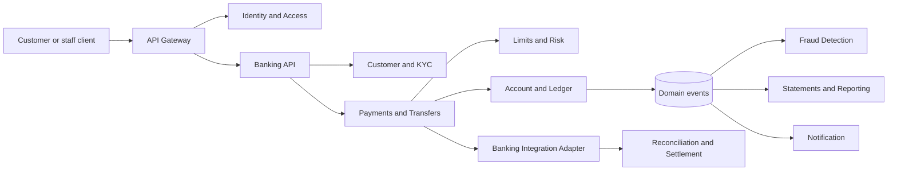
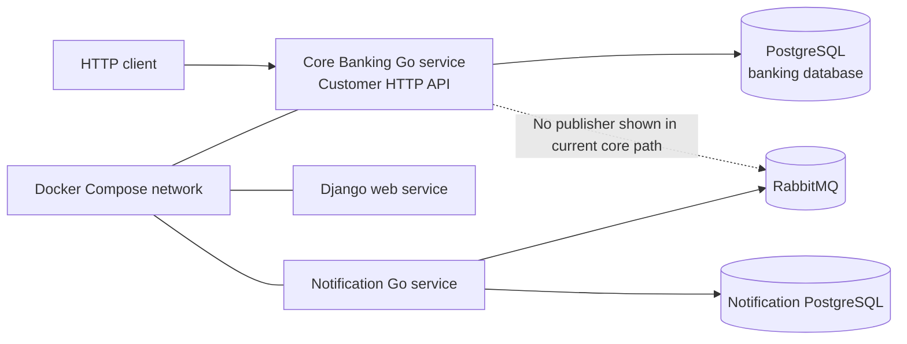
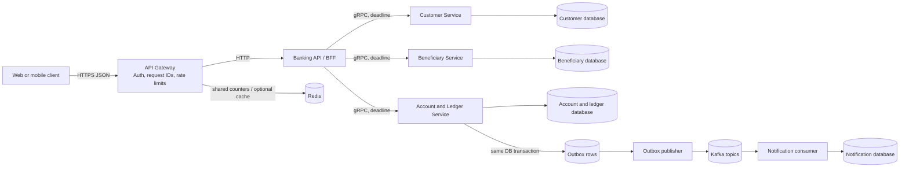
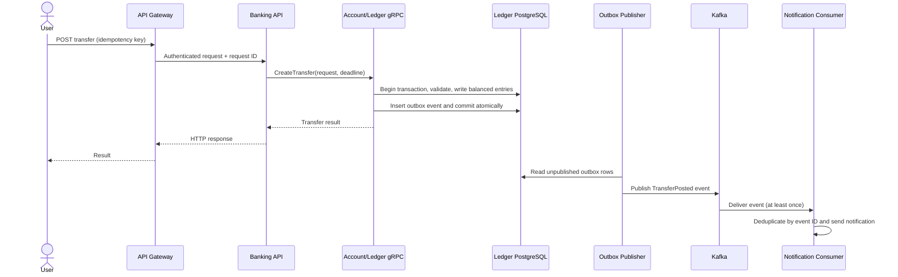
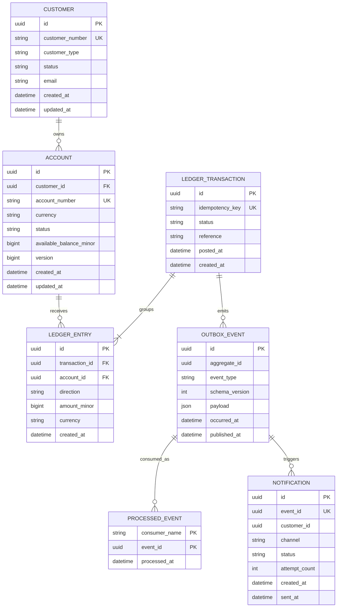

# Core Banking: Microservices Learning Roadmap

This guide proposes a practical, build-first way to learn microservice architecture in this repository. It is a roadmap, not a description of features that already exist. Keep the monorepo and current applications running, then add one small service beside them. You can learn independent builds, deployment, data ownership, gRPC, and failure handling by creating a service without first breaking up the existing code.

## 1. Where the project is today

The repository is a monorepo containing Django, a Go core-banking service, and a Go notification service. Docker Compose runs these with PostgreSQL and RabbitMQ.

The Go core-banking service currently has a small customer HTTP API:

- `internal/customer/handler.go` decodes HTTP requests and writes responses.
- `internal/customer/service.go` contains customer use cases and validation calls.
- `internal/customer/repository.go` and `queries.go` access PostgreSQL through `pgx`.
- `internal/app/app.go` wires dependencies, opens one PostgreSQL connection, registers HTTP routes, and starts the server.
- `internal/account/` and `internal/transaction/` are currently empty. The core service's `migrations/` directory is also empty.

The notification service currently consumes account-pattern messages from RabbitMQ and stores processed-event state in its own PostgreSQL database. The current core customer code does not show a RabbitMQ publisher or Kafka integration. Treat event production as future work.

Useful starting points: [service bootstrap](internal/app/app.go), [customer handler](internal/customer/handler.go), [customer service](internal/customer/service.go), [customer repository](internal/customer/repository.go), [Compose topology](../docker-compose.yml), and [notification RabbitMQ setup](../notification-service/messaging/rabbitmq.go).

## 2. Recommended direction

Keep one repository. A monorepo is compatible with microservices: services can have separate entrypoints, containers, deployment lifecycles, and owned data while sharing version control and local development tooling.

Since the goal is to learn by building services, do not make extracting the existing Django or Go code your first exercise. Add a new, low-risk **Beneficiary Service** as a sibling to the existing services. It owns saved payees (name, destination reference, status); it does not hold balances or move money. Give it its own Go module, executable, container, database, and migrations. The existing Go HTTP API can call it over gRPC, giving you a real service boundary while leaving current customer flows intact.

Then build the more financially sensitive boundaries deliberately:

- **Customer Service** owns customer identity and customer data.
- **Account/Ledger Service** owns accounts, postings, and balances.
- **Payments Service** owns transfer instructions and their lifecycle, and requests postings from the ledger.
- **Notification Service** owns delivery attempts and notification preferences.
- **Banking API** exposes the public HTTP API and calls internal services.

Each service owns its schema and migrations. Other services must not query its tables directly. Share data through a service API or published event, not through cross-service SQL joins.

## 3. Banking service candidates

A real bank may have many bounded contexts, but do not turn every noun into a network service on day one. Begin with a few cohesive deployable services and keep the others as modules until they have different scaling, security, ownership, or release needs.

| Candidate service | Banking responsibility and owned data | When to introduce |
| --- | --- | --- |
| **Identity and Access** | User login, credentials or identity-provider integration, MFA enrollment, sessions, roles, and service identities. It should not own customer account balances. | Early, when adding authenticated users or staff access. Prefer an established identity provider for production rather than building password security yourself. |
| **Customer and KYC** | Customer profile, business/individual details, verification cases, evidence references, and onboarding status. Keep sensitive identity documents in protected storage, not event payloads. | Early, alongside customer onboarding; can begin as a module in the current Go service. |
| **Beneficiary Management** | Saved payees, destination references, display names, and active/blocked status. It does not validate balances or execute payments. | A good first independently deployed service for learning because it has useful banking behavior without owning money movement. |
| **Account and Ledger** | Account lifecycle, currency, holds, postings, immutable debit/credit entries, and balance invariants. Owns the authoritative financial record. | Core domain; implement first as one cohesive boundary and one database transaction. |
| **Payments and Transfers** | Payment instructions, beneficiaries, transfer state machine, idempotency, rail-specific status, and payment orchestration. It requests postings from the ledger; it must not edit ledger tables. | After account and ledger correctness is established. Start with internal transfers before external rails. |
| **Limits and Risk** | Per-customer/account/channel limits, velocity checks, risk decisions, and decision reasons. A risk decision is not itself a ledger posting. | Add when transfers need configurable controls; begin as an in-process module, then extract if policy ownership or throughput warrants it. |
| **Fraud Detection** | Rules and signals for suspicious activity, alert/case state, and review outcomes. Consumes transaction events; time-critical authorization checks need an explicit synchronous contract. | Later learning stage, after reliable event publication and event history exist. Do not block every posting on an experimental asynchronous model. |
| **Card Management** | Card token/reference, lifecycle, controls, and authorization state. Keep PCI-sensitive data out of the general core; use a compliant processor/provider for real card data. | Optional domain extension after transfers; keep payment-card data boundaries explicit. |
| **Fees and Pricing** | Fee schedules, product pricing, effective dates, and calculated fee decisions. The ledger records resulting postings; it should not own mutable pricing rules. | When products need distinct fee policies; initially a module with versioned rules. |
| **Statements and Reporting** | Statement periods, generated documents, and read-optimized reporting projections. Builds from ledger data/events and never becomes the write authority for balances. | After ledger events exist or customer-facing statements are needed. |
| **Notification** | Email/SMS/push delivery preferences, templates, attempts, provider responses, and deduplication state. Consumes domain events and does not participate in ledger commits. | Already present as a separate service; connect through a reliable event contract. |
| **Reconciliation and Settlement** | Compare internal postings with payment-rail/provider files, track unmatched items, and record investigation/resolution state. | Later, once external payments or asynchronous providers are introduced. |
| **Audit and Compliance** | Tamper-evident records of sensitive administrative actions, retention policies, and compliance workflow references. Keep audit requirements separate from verbose application logs. | Establish audit events early for sensitive operations; a separate service/store can come later based on requirements. |
| **Banking Integration Adapters** | Provider-specific API/file translation, credentials references, callbacks, and retry state for external rails or vendors. | Introduce when integrating an external payment provider; isolate provider quirks from payment and ledger domain logic. |

### A practical service map



This is a capability map, not a required call graph or deployment plan. For example, staff authentication may be handled by an external identity provider, and payments may call the ledger synchronously to post a transfer while publishing an event for statements and notifications. Avoid a chain of synchronous calls across every box: it increases latency and makes one outage cascade through the whole request.

## 4. Architecture diagrams

### Current topology (simplified)



The diagram is intentionally conservative: it shows the configured core database and the notification consumer infrastructure without assuming that the current Go core service publishes events.

### Learning target after the service boundary is introduced



This is a learning target, not a requirement to create all these processes at once. Keep the account and ledger together initially: their writes need strong consistency. The Banking API may initially be part of the existing Go process; extract it only when you are ready to operate multiple processes.

### Request and event flow



The HTTP response does not wait for email delivery. Kafka delivery is normally at least once, so consumers must be idempotent. An outbox prevents the database commit succeeding while its corresponding event is silently lost; it does not make Kafka and PostgreSQL one distributed transaction.

## 4. Conceptual data model

The following model is for learning and requires domain review before use with real financial data. It is not present in the current core migrations.



Important invariants and design notes:

- Store money as integer minor units (such as cents) plus an explicit currency; do not use floating-point values.
- A posted ledger transaction has balanced entries per currency: total debits equal total credits. Validate and insert all entries atomically.
- Ledger entries are immutable after posting. Corrections use compensating transactions rather than editing history.
- A cached or materialized account balance can improve reads, but it must be updated in the same database transaction as ledger postings and reconcilable against entries. PostgreSQL remains authoritative; Redis is never the source of truth for balances.
- Enforce unique customer/account numbers and unique idempotency keys in the database. Scope idempotency keys to the relevant client or operation if needed.
- `processed_event` uses `(consumer_name, event_id)` as a unique key to make redelivery harmless. Notification state belongs to the notification service.
- The exact account model, holds, reversals, overdrafts, and compliance fields need explicit domain decisions; this simplified model is not a complete banking ledger design.

## 5. Learning plan

### Phase 1: Create and deploy a small service

Add a `beneficiary-service/` directory beside `core-banking-service/` and `notification-service/`. Give it its own Go module, `cmd/server` entry point, internal packages, migrations, Dockerfile, and PostgreSQL database. Implement a small saved-beneficiary API (create, list, deactivate) and health/readiness endpoints. Start it in Compose without changing the existing core service.

**Done when:** the beneficiary service can be built and restarted independently, its data persists in its own database, and stopping the core service does not stop the beneficiary service. No service reads another service's tables.

### Phase 2: Connect services with gRPC

Define a `.proto` contract for beneficiary operations and generate Go code. Keep the contract independent from database structs. Add a gRPC server to Beneficiary Service and have the existing Go HTTP API call it as a client. Set deadlines, propagate cancellation, map gRPC status codes to HTTP responses, and add health checks and contract tests.

**Done when:** an HTTP request to the existing API reaches Beneficiary Service over gRPC in Compose; a stopped or slow beneficiary service yields a bounded, understandable failure rather than a hung request.

### Phase 3: Build the financial core as a separate service

Add an independently deployable Account/Ledger Service with its own database and migrations. Implement account creation and one internal transfer posting. Require an idempotency key and atomically write balanced debit/credit entries. The ledger is the sole authority for posted money; no other service edits its tables. Keep this first transfer flow small and avoid external payment rails.

**Done when:** tests prove a posting is all-or-nothing, duplicate idempotency keys do not create a second posting, entries balance by currency, and the existing API calls the ledger through a bounded gRPC request.

### Phase 4: Harden each process as you build it

Add configuration validation, connection pooling, graceful shutdown, structured logs, health/readiness endpoints, and focused unit/integration tests to the new services and existing core API. Keep handlers thin and test business logic independently from network servers.

**Done when:** each process starts from Compose, readiness reflects its required dependencies, shutdown closes resources, and core use cases have tests that do not require a live HTTP server.

### Phase 4: Add the API gateway

Put a gateway in front of public HTTP endpoints. It should own edge concerns such as TLS termination in production, authentication validation, request IDs, coarse request-size limits, routing, and rate limiting. Keep business rules in services. For a learning setup, compare a small Go reverse proxy with a locally runnable, off-the-shelf gateway; choose one and document the routing/configuration rather than maintaining both.

**Done when:** clients use one public base URL, internal service ports are not exposed as public routes, and request identity is traceable through logs.

### Phase 5: Add Kafka for domain events

Use Kafka for durable event streams and decoupled consumers, not for every internal function call. Introduce a transactional outbox in the service that owns the database write. Publish versioned events such as `AccountOpened` or `TransferPosted`. Consumers must deduplicate by event ID, retry transient failures, and route poison messages to a dead-letter topic with alerting and a replay procedure.

The repository already has RabbitMQ in the notification path. For a focused Kafka learning project, migrate that notification subscription to Kafka after the outbox and consumer are tested, then remove RabbitMQ if it has no remaining use. Avoid running both brokers indefinitely for the same event. If you want to compare them, make the parallel period a short, documented exercise.

**Done when:** a committed database change eventually produces an event after a process restart; replaying an event does not send duplicate notifications; and failed events are observable and recoverable.

### Phase 6: Use Redis for a justified purpose

First add gateway rate limiting backed by Redis, with a clear policy (for example, per client and route). Define behavior when Redis is unavailable: fail open or closed based on endpoint risk, and make that choice explicit. Optionally add a short-lived cache for non-authoritative reads with TTLs and invalidation rules. Never cache an authorization decision or use a Redis value to approve a ledger posting.

**Done when:** integration tests cover limit, reset/expiry, and Redis outage behavior; cached data is disposable and can be rebuilt from PostgreSQL.

### Phase 7: Add resilience and observability

Apply timeouts to every network call. Add circuit breakers around remote dependencies to stop repeated calls to a failing service, bounded retries only for safe/idempotent operations, and bulkheads to limit resource exhaustion. Return a clear unavailable response when a dependency is unhealthy; do not invent fallback balances or approve financial writes during an outage. Add metrics and distributed traces with a shared trace/request ID across gateway, gRPC, and Kafka headers.

**Done when:** failure-injection tests demonstrate bounded latency, no retry storm, useful logs/metrics, and correct recovery after a dependency returns.

### Phase 8: Deploy and operate the learning system

Use Docker Compose first for repeatable local development. Add container health checks, startup ordering based on health (not just process start), migration jobs, and separate environment configuration. After the service boundaries work locally, deploy to Kubernetes as a separate learning milestone: Services, Deployments, probes, Secrets, resource limits, and rolling updates.

**Done when:** a clean environment can be started from documented commands and the services recover predictably from restarts.

## 6. Communication and failure rules

| Need | Prefer | Rules |
| --- | --- | --- |
| Immediate decision/result needed | gRPC | Set deadline; propagate cancellation; map errors; keep APIs backward-compatible. |
| Notify other bounded contexts that something happened | Kafka event | Publish through outbox; include event ID, type, version, aggregate ID, and occurrence time; consumers are idempotent. |
| Public client access | HTTP through gateway | Authenticate at the edge and authorize in the owning service; propagate identity, not trusted client-supplied headers. |
| Request throttling | Redis-backed gateway limiter | Define key, window, quota, and Redis outage policy; never rely on in-process counters across replicas. |
| Slow/failing dependency | Timeout + circuit breaker | Avoid unbounded retries; retry only safe operations with backoff and jitter. |

Do not make a ledger write depend on notification availability. Do not hold a database transaction open while making a network call. Do not let services share another service's tables. Do not use retries as a substitute for idempotency.

## 7. Suggested monorepo shape

Evolve toward a structure like this only as each part is implemented:

```text
core-banking-service/
  cmd/
    banking-api/
    customer-service/       # only after extraction
    ledger-service/         # only after extraction
  internal/
    customer/
    account/
    ledger/
    outbox/
  api/
    proto/
  migrations/
notification-service/
api-gateway/                 # optional standalone gateway config/service
```

Share generated API contracts and small tooling deliberately. Avoid sharing domain models or persistence code between services; those shortcuts couple independent deployments.

## 8. Verification checklist

- **Unit:** validation, ledger invariants, idempotency decisions, rate-limit policy.
- **Integration:** each service with its own PostgreSQL schema/database; migrations; outbox publisher; Kafka consumer; Redis limiter.
- **Contract:** protobuf compatibility and event schema compatibility.
- **Failure mode:** PostgreSQL/Kafka/Redis unavailable, slow gRPC response, duplicate/reordered event, poison event, service restart.
- **End to end:** public request through gateway, ledger result, event publication, notification outcome.
- **Security:** keep credentials out of committed Compose files; use environment/local secret files for development and a secret manager in production; minimize customer PII in events/logs; authenticate service identities and authorize operations.

## 9. Recommended order at a glance

1. Build and independently deploy Beneficiary Service with its own database.
2. Call it from the existing Go HTTP API over gRPC with deadlines and contract tests.
3. Build Account/Ledger Service as a separate process and prove transactional correctness.
4. Add the public gateway and edge rate limiting.
5. Add the transactional outbox and Kafka consumer; migrate notifications from RabbitMQ once ready.
6. Add Redis for rate limiting and, only if measured, non-authoritative caching.
7. Add circuit breakers, failure-injection tests, metrics, and traces.
8. Practice Kubernetes deployment after the local Compose architecture is reliable.

The point is not to maximize the number of technologies. It is to learn what each boundary costs: network calls fail, events repeat, caches go stale, and independent data ownership requires explicit contracts.